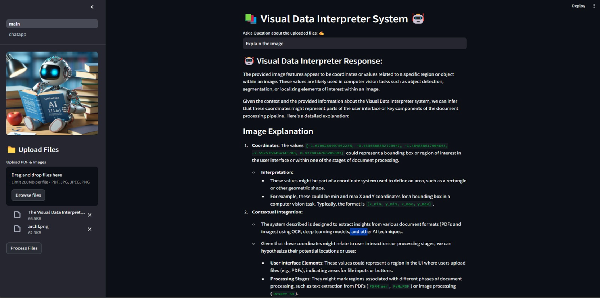
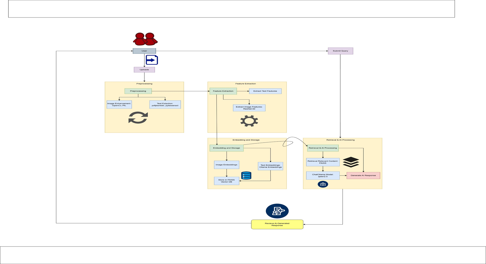

# InkSync 📚ChatApp AI Agent 🤖

InkSync is an intelligent AI assistant that seamlessly analyzes images and supporting documents, delivering context-aware descriptions in the user's preferred language. With its powerful capabilities, InkSync not only interprets visuals but also generates well-structured, downloadable documents.

## 📝 Description

The InkSync and Image Chat Agent is a Streamlit-based web application that allows users to interact with a chatbot trained on text extracted from PDF documents and images. The chatbot is powered by Ollama's LLM and supports multilingual responses.

## 📢Demo App with Streamlit Cloud (Visualize only)

[Launch App On Streamlit](https://multi-pdfschatappai-agent.streamlit.app/)

## 💻 Demo:



## 🎯 How It Works:

---



The application follows these steps to provide responses to your questions:

1️⃣ Upload Files – Users can upload multiple PDFs and images (JPG, PNG, JPEG).

2️⃣ Extract Text & Features –

->PDFs: Text is extracted using pdfplumber.

->Images: Text is extracted using OCR (pytesseract), and key features are extracted using ResNet-50.

3️⃣ Store Data – The extracted text is split into chunks and stored in a FAISS vector database for efficient retrieval.

4️⃣ Ask a Question – Users enter a question related to the uploaded files.

5️⃣ Find Relevant Information – The app searches the FAISS database for the most relevant text related to the question.

6️⃣ Generate a Response –

Uses Ollama’s Chat Model (qwen2.5) to process the context and generate an answer.

If images were uploaded, the response also includes insights based on extracted features.

7️⃣ Multilingual Support – Users can choose a preferred language, and the chatbot provides responses accordingly.

8️⃣ Download Report – Users can download a PDF report containing the chatbot's response and extracted content.

---

## 🎯 Key Features

- **Adaptive Chunking** : Uses Sliding Window Chunking to dynamically adjust window size and position, optimizing Retrieval-Augmented Generation (RAG) based on data complexity and context.

- **Multi-Document Conversational QA** : Supports multi-hop queries across multiple documents, overcoming single-document limitations for better contextual understanding.

- **File Compatibility** : Supports PDF and TXT file formats, along with multi-file uploads (PDFs, JPG, PNG, JPEG).

- **Text & Feature Extraction** :

PDFs → Extracts text using pdfplumber.

- **Images** : Extracts text via OCR (pytesseract) and key features using ResNet-50.

- **Fast & Efficient Search** : Uses FAISS vector database for high-speed retrieval of relevant information.

- **AI-Powered Answers** : Leverages Ollama’s Chat Model (qwen2.5) to generate precise responses.

- **Multilingual Support** : Enables queries and answers in multiple languages.

- **Downloadable Reports** : Provides PDF reports with extracted insights and responses.


## 🌟 Requirements

- **Python 3.8+** – Ensure you have Python installed.
- **FAISS** – For fast similarity search.
- **pdfplumber** – Extracts text from PDF files.
- **pytesseract** – OCR for extracting text from images.
- **ResNet-50** – Extracts key features from images.
- **Ollama’s Chat Model (qwen2.5)** – AI-powered responses.
- **Flask/FastAPI** – Backend API for processing requests.
- **Torch & Transformers** – Required for AI model inference.
- **Langchain** – Framework for Retrieval-Augmented Generation (RAG).
- **Tika** – Parses various file formats.
- **OpenCV** – Image preprocessing.

## ▶️Installation

Clone the repository:

`git clone https://github.com/anusha9573/Multi-PDFs_ChatApp_AI-Agent.git`

Install the required Python packages:

`pip install -r requirements.txt`

Run the Streamlit app:

`streamlit run main.py`

---

## 💡 Usage

To use the **AI-Powered Document Chat App 🤖**, you can access it here: [Launch App on Streamlit](https://your-app-link.com/).

If you want to run and implement the project on your system, follow these steps:

1. **Install Dependencies** – Ensure all required dependencies are installed.
2. **Set Up Environment Variables** – Add the **API keys** in the `.env` file (MUST).
3. **Run the Application** – Execute the following command:
   ```bash
   streamlit run main.py
   ```

## ©️ License 🪪

Distributed under the MIT License. See `LICENSE` for more information.

---

#### **If you like this LLM Project do drop ⭐ to this repo**

#### Follow me on [](https://www.linkedin.com/in/addepati-anusha-77937a248/) &nbsp; [](https://github.com/anusha9573)

---

"# InkSync"
